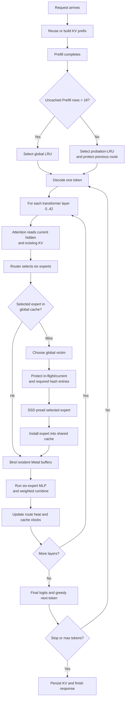

# Formal Decode flow

This is the production Decode path for the fixed DeepSeek-V4-Flash-0731
runtime on the M4 Mini.  Prefill is deliberately outside this flow.

## Production cache rule

The Decode expert cache is one global pool of about 967 entries.  There is no
per-layer fixed reservation in production.  A miss can evict an eligible entry
from any layer, subject to these protections:

1. in-flight entries;
2. the current layer's selected experts;
3. the required hash-layer protection;
4. the previous route during the short probation-LRU regime.

The cache policy only chooses the victim.  It does not change Router results,
the six selected expert IDs, the weighted expert combine, or greedy sampling.
